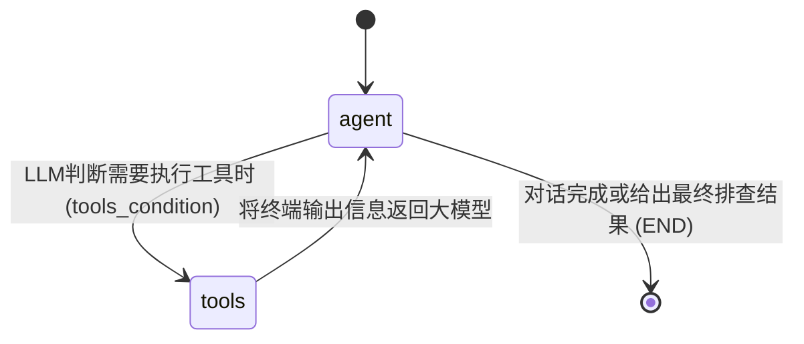

# Hardware Debugging Assistant (硬件调试 Agent)

这是一个基于 [LangGraph](https://langchain-ai.github.io/langgraph/) 和 **DeepSeek** 大模型的智能硬件调试助手。
用户可以通过自然语言描述他们遇到的硬件问题，Agent 将会自动连接至设备（支持 SSH 或串口），并在目标设备上执行命令、分析输出结果，从而帮助用户定位并解决问题。


## 功能特性

1. **自然语言交互**：只需告诉 Agent “我的网卡不见了”或“检查一下系统负载”，Agent 就会自动想办法帮你查找原因。
2. **多协议连接支持**：
   - **SSH**：支持用户名/密码，或基于 Key 的无密码登录。
   - **串口 (Serial)**：支持直接连接诸如 CH340, CP210x 等芯片的普通 COM 口。
3. **自主决策能力**：借助于 LangGraph 的带有工具调用的状态图 (StateGraph)，Agent 会执行指令，获取输出；如果信息不足，会继续执行更多诊断命令（类似 ReAct 模式）。
4. **LLM 模型管理**：默认采用兼容 OpenAI 接口标准的 DeepSeek (`deepseek-chat`)。
5. **智能密码交互逻辑**：当远端设备（SSH/串口）提示输入密码（如执行 `sudo` 等特权指令）时，Agent 的执行通道能够自动挂起并在本地控制台或网页端安全地请求用户输入密码，随后静默回传给设备。
6. **闭环指令验证**：约束模型在对系统进行状态更改（如安装软件、修改系统配置）后，强制去执行相关的二次验证操作（如检查进程状态或获取版本号），自动防范执行失败导致的伪成功反馈。
7. **高级 Web UI**：内置基于 FastAPI 和 WebSockets 的图形化页面，提供暗黑主题玻璃拟态界面、终端打字机效果输出以及直观的思考过程展示。
8. **交互死锁防火墙**：在底层流处理与 Agent 认知级别双重设防，自动拦截或处理诸如 `htop`、`vim`、`less` 等会导致 PTY 终端永久挂起的命令。

---

## 技术架构说明

本项目的核心工作流通过 LangGraph 进行状态流转，结构大纲如下：



本系统主要利用如下技术栈：
- **LangChain/LangGraph**：用于定义包含状态、条件路由的工作流图，实现循环调用的 Agent。
- **paramiko**：用于通过 SSH 连接设备，包含通过 PTY 环境获取和发送控制台数据的轮询功能。
- **pyserial**：用于通过串口 (Serial) 读写设备。
- **langchain-openai**：由于 DeepSeek 官方兼容 OpenAI API 标准，因此可以直接利用该模块调用。

### 目录结构

```
ssh-helper/
├── agent.py           # 定义 LangGraph 状态图与 Agent 节点、工具节点的路由逻辑
├── llm.py             # 配置与初始化 DeepSeek 大模型
├── tools.py           # 定义硬件命令执行框架与 PTY 死锁拦截防火墙
├── web_server.py      # 【推荐】Web 服务端入口，提供网页端全双工实时流式交互
├── static/            # 前端 Web UI 资源 (index.html, style.css, app.js)
├── main.py            # 【旧版】CLI 纯命令行终端交互入口
├── requirements.txt   # Python 依赖清单
├── .env.example       # 环境变量配置模板
└── README.md          # 帮助文档
```

---

## 快速运行

### 1. 安装依赖

确保你的 Python 环境是 `3.8+`，然后在项目根目录下运行：

```bash
pip install -r requirements.txt
```

### 2. 配置大模型 API

复制环境变量模板并填入你的 DeepSeek API Key：

```bash
cp .env.example .env
```

编辑 `.env` 文件，修改如下字段：
```env
DEEPSEEK_API_KEY=your_actual_api_key_here
```

### 3. 开始使用

你可以选择通过 **Web 可视化界面** 或者 **传统终端命令** 的方式启动助手。

#### 方案 A：Web 界面可视化调试（推荐 ✨）

运行 Web 服务：
```bash
python web_server.py
```
终端提示启动成功后，打开浏览器访问 👉 `http://localhost:8000/`

在页面左侧的侧边栏输入设备的 SSH 或 Serial 连接信息点击连接，然后在右侧输入你的硬件排错问题，例如：“网卡不见了，帮我查一下硬件层和驱动层的原因”。当碰到特权命令，页面中央会弹出输入密码的浮窗，输入即可放行指令。

#### 方案 B：传统 CLI 命令行模式

如果你偏好纯无头终端，可以直接运行：
```bash
python main.py
```
按照终端提示输入 `ssh root@192.168.1.50 22` 或 `serial COM3 115200` 即可连接并开始问答。

---

## 扩展与自定义

- **增加工具**：如果你想赋予它更多的能力（如上传文件、特定脚本执行），只需在 `tools.py` 添加使用 `@tool` 装饰器的函数，并更新 `agent.py` 中的 `tools` 列表配置。
- **修改 Agent 行为**：修改 `agent.py` 中的 `SYSTEM_PROMPT`，你可以针对特定的开发板告诉它预先需要知道的特定指令。
